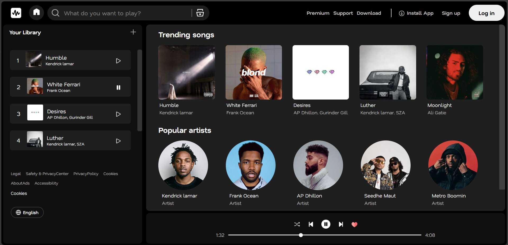

# Resona 🎵



Resona is a **web-based music application** where users can enjoy a limited collection of songs.  
This project is currently **client-side only** and focuses on UI design and user experience.  

As a **UI design project**, it showcases a modern music streaming interface, including trending songs, popular artists, and a library section. More features and advanced functionality will be added in future updates to make this project even more interactive and dynamic.

---

## 🌐 Project URL
You can view the live project [here](https://resona-wheremusicresonates.netlify.app/)

---

## 🚀 Features
- Play songs directly from the interface.
- Explore popular artists.
- Fully designed UI with focus on user experience.
- Planned future enhancements:
  - Dynamic song loading from API
  - Playlist creation
  - Responsive mobile-friendly design

---

## 💻 Getting Started

Follow these steps to clone and run the project locally:

1. **Clone the repository**  
```bash
git clone https://github.com/Pranjl7/Resona.git
cd Resona
```

## 🤝 Contributing
  Contributions, issues, and feature requests are welcome! Feel free to check the issues page.

## 📜 License
Distributed under the MIT License.